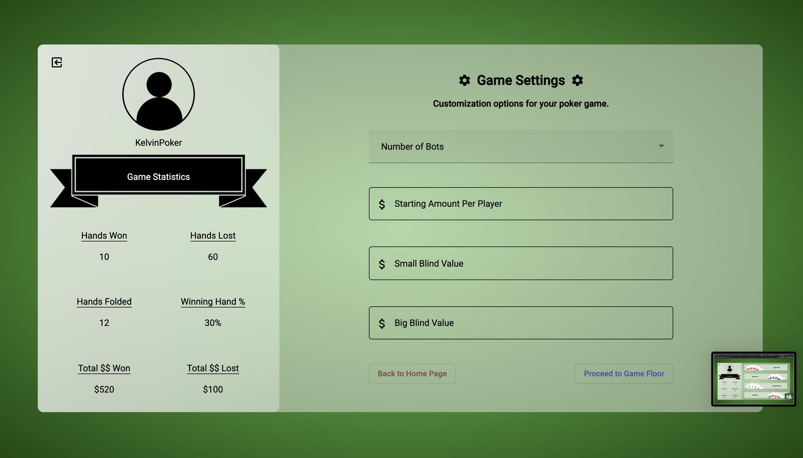

# Poker

This application will allow the user to play poker against computer bots and to keep record of statistics.

# Website

* The project is currently hosted on Heroku: https://game-of-poker.herokuapp.com/

# CHANGE LOGS

* 4/14
  * Website is hosted on Heroku
  * Current capabilities: front end visuals, providing accurate hands for blackjack, displaying correct number of computer bots to play against
  * No back end implemented as of yet, no actual function besides displaying 2-hand cards in blackjack

## General Notes:

* will utilize the MEAN stack (e.g. MongoDB, Express.js, Angular, Node.js)

## Current thinking of what application will be 

* log in system / backend to database
	* database
	*	user sign in / password
	*	user stats
		*	total game wins / losses / hands won / number of forfeits
*	game settings before starting a game:
	*	how to determine winner (# of rounds played or until last one standing)
*	landing page
	*	log in / sign up / enter as guest
*	when client is passed the login / sign up page, what should they see:
	*	the user profile
		*	the name of the user
		*	picture / emoji 
	*	the main buttons 
		*	single player
			*	set rules (# of bots, bot difficulty, win state (either # of rounds or until someone has all coins)
		*	multi-player
			*	(to implement after single player is implemented, we’ll see…)
			*	
## Current images as of March 2021:

* Landing Page:
  * user has three options: log in, sign up, or use as guest

* Signing into application (when you already have an account):
  * email and password required 
  * user can switch to sign up page if user has no registered account yet
  * clicks on 'register' button to register

* Signing up (registering for an account):
  *  email, password, re enter password, and display name required
  *  can switch to log in page if user already has an account
  *  clicks on 'sign up' to sign up

* Home page when you log in to your account:
  * two sections: the profile and game stats on left, and the game menu on the right    

* when clicking on single player, it takes you to game settings (setting up your customized poker game):
  * user can dictate what values the user wants their game to be set at 

* Getting into the single player game (5 bots have been selected for this image):
  * depending on number of bots set in game settings page determines how many player/bot mats you see on screen 

* Game starts and every player has their respective cards:
 * game is currently coded to utilize a 52 card deck, and every hand is randomized and to fit within the deck
 * still in progress to make game work as intended like in the game of poker 

